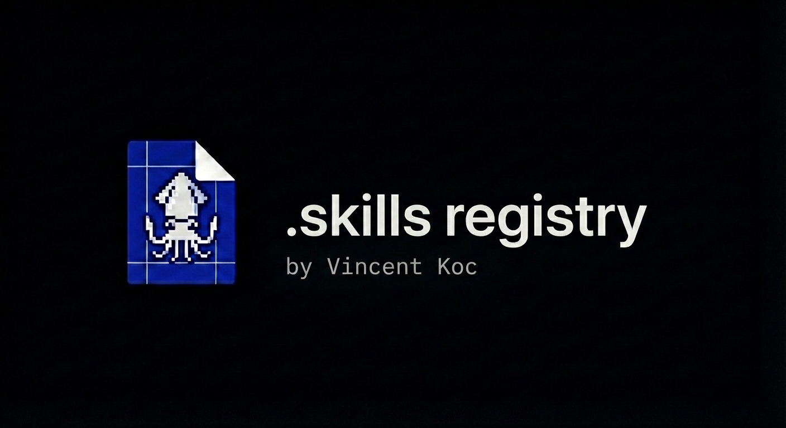

<div align="center">

  

# .skills (dotskills)

[](https://github.com/vincentkoc/dotskills/actions/workflows/validate.yml)
[](https://github.com/vincentkoc/dotskills/actions/workflows/release.yml)
[](https://github.com/vincentkoc/dotskills/actions/workflows/verify-install.yml)
[](https://github.com/vincentkoc/dotskills/actions/workflows/codeql.yml)
[](LICENSE)
[](https://github.com/vincentkoc/dotskills/tags)
[](CONTRIBUTING.md)

</div>

We are moving from "prompt as text" to **skill as runtime module**. Each skill acts like a lightweight, containerized application for AI work: a stable interface, opinionated workflow, and bundled resources that can be installed, versioned, tested, and reused across projects.

## How this repo works

This is my personal **.skills** repository for Codex, Cursor, OpenClaw and agent-first tooling. `.skills` is the dotfiles mindset applied to AI execution: instead of one-off prompts, this repo stores reusable skill units that bundle:

- prompt logic (`SKILL.md` / `AGENT.md` / `AGENTS.md`)
- references and knowledge assets
- scripts for deterministic execution
- repeatable validation + publishing workflows
- support external skills through submodules
- git managed personal registry and github action hooks

## Public skills

| Skill | What it does | Install |
|---|---|---|
| `technical-deslop` | Ship clean diffs fast: remove AI noise and keep behavior unchanged. | `npx skills add vincentkoc/dotskills --skill technical-deslop -y` |
| `technical-documentation` | Produce dev‑ready docs: clear, structured build/review for brownfield + evergreen. | `npx skills add vincentkoc/dotskills --skill technical-documentation -y` |
| `technical-integrations` | Design integrations that land: vendor‑agnostic API/RFC/SDK plans with rollout safety. | `npx skills add vincentkoc/dotskills --skill technical-integrations -y` |
| `technical-skill-finder` | Turn real agent pain into new skills: mine logs, rank wins, draft next steps. | `npx skills add vincentkoc/dotskills --skill technical-skill-finder -y` |
| `openclaw-github-dedupe` | Triage GitHub issue/PR clusters, preserve contributor credit, and manage canonical duplicates safely. | `npx skills add vincentkoc/dotskills --skill openclaw-github-dedupe -y` |

Internal/private workflow skills can live in this repo and are marked in the metadata as `internal: true` and excluded from public marketplace/release artifacts.

## Install

Install one skill:

```bash
npx skills add vincentkoc/dotskills --skill technical-deslop -y
npx skills add vincentkoc/dotskills --skill technical-documentation -y
npx skills add vincentkoc/dotskills --skill technical-integrations -y
npx skills add vincentkoc/dotskills --skill technical-skill-finder -y
npx skills add vincentkoc/dotskills --skill openclaw-github-dedupe -y
```

List available public skills:

```bash
npx skills add vincentkoc/dotskills --list
```

Default sync targets are managed automatically by vercel skills.

## Codex slash commands

This repo can also mirror Codex slash-command prompts from `vendor/` and sync them to `~/.codex/prompts`.

- `make sync` now syncs skills and slash commands for the `codex` profile.
- vendored command currently included: `/sectriage` from `steipete/agent-scripts`.

## Repository layout

```text
skills/                      # First-party skills
  <skill-name>/
    SKILL.md|AGENT.md|AGENTS.md
    references/
    scripts/
private-skills/              # Private/local-only skills (not published)
  <skill-name>/
    SKILL.md|AGENT.md|AGENTS.md
    references/
    scripts/
vendor/                      # Third-party mirrored/imported skills
.assets/                     # Shared visual assets (banner/icon)
bin/agent-skills             # List/validate/sync/import
scripts/                     # Validation + publishing automation
catalog.yaml                 # Skill metadata catalog
.claude-plugin/marketplace.json
releases/skills.json
```

## Validation

`make validate` now runs:

1. repo policy checks (`Purpose/When to use/Workflow/Inputs/Outputs`, entry-file checks)
2. AgentSkills spec checks for local `SKILL.md` skills (`name`/`description` constraints, frontmatter validity, relative resource references, one-level reference depth)
3. public skill OpenAI metadata checks (`agents/openai.yaml`, required interface fields, default icons/brand from `AGENTS.md`, and icon path existence)

If installed, the external reference validator is also used:

```bash
skills-ref validate ./skills/<skill-name>
```

## Why .skills

Dotfiles configure machines.
`.skills` configures AI execution quality.

This repo is meant to be composable, auditable, and practical: skills should be testable artifacts, not throwaway prompt snippets.

## Contributing

Read [CONTRIBUTING.md](CONTRIBUTING.md) and [CODE_OF_CONDUCT.md](CODE_OF_CONDUCT.md).
