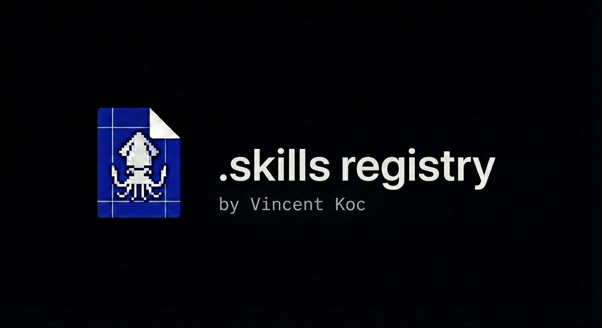

<div align="center">

  

# .skills (dotskills)

[](https://github.com/vincentkoc/dotskills/actions/workflows/validate.yml)
[](https://github.com/vincentkoc/dotskills/actions/workflows/release.yml)
[](https://github.com/vincentkoc/dotskills/actions/workflows/verify-install.yml)
[](https://github.com/vincentkoc/dotskills/actions/workflows/codeql.yml)
[](LICENSE)
[](https://github.com/vincentkoc/dotskills/tags)
[](CONTRIBUTING.md)

</div>

We are moving from "prompt as text" to **skill as runtime module**. Each skill acts like a lightweight, containerized application for AI work: a stable interface, opinionated workflow, and bundled resources that can be installed, versioned, tested, and reused across projects.

## How this repo works

This is my personal **.skills** repository for Codex, Cursor, OpenClaw and agent-first tooling. `.skills` is the dotfiles mindset applied to AI execution: instead of one-off prompts, this repo stores reusable skill units that bundle:

- prompt logic (`SKILL.md` / `AGENT.md` / `AGENTS.md`)
- references and knowledge assets
- scripts for deterministic execution
- repeatable validation + publishing workflows
- support external skills through submodules
- git managed personal registry and github action hooks

## Public skills

| Skill | What it does | Install |
|---|---|---|
| `codebase-memory-mcp` | Index canonical Git checkouts through a guarded CLI and audit duplicate worktree caches. | `npx skills add vincentkoc/dotskills --skill codebase-memory-mcp -y` |
| `codex-goal-mining` | Mine local or fleet Codex goal history into evidence-backed rerun suites. | `npx skills add vincentkoc/dotskills --skill codex-goal-mining -y` |
| `codex-session-recovery` | Recover Codex and Claude tmux sessions without overwriting restore evidence. | `npx skills add vincentkoc/dotskills --skill codex-session-recovery -y` |
| `crabpot-perf-metrics` | Interpret Crabpot and OpenClaw performance artifacts without over-reading noise. | `npx skills add vincentkoc/dotskills --skill crabpot-perf-metrics -y` |
| `crawlkit` | Maintain and release the shared crawl app Go library. | `npx skills add vincentkoc/dotskills --skill crawlkit -y` |
| `graincrawl` | Maintain and release the local-first Granola archive CLI. | `npx skills add vincentkoc/dotskills --skill graincrawl -y` |
| `ghcrawl-cluster-operator` | Operate ghcrawl local sync, clustering, and cluster inspection from the CLI. | `npx skills add vincentkoc/dotskills --skill ghcrawl-cluster-operator -y` |
| `openclaw-github-dedupe` | Triage GitHub issue/PR clusters across repositories, preserving contributor credit while selecting canonical fixes and safe closures. | `npx skills add vincentkoc/dotskills --skill openclaw-github-dedupe -y` |
| `openclaw-pr-batch-sweep` | Select and land bounded batches of low-risk OpenClaw contributor pull requests. | `npx skills add vincentkoc/dotskills --skill openclaw-pr-batch-sweep -y` |
| `org-branch-cleanup` | Audit and safely prune stale merged branches across a GitHub organization. | `npx skills add vincentkoc/dotskills --skill org-branch-cleanup -y` |
| `opik-integrations-auditor` | Audit Opik integration coverage across SDK and OTEL/API surfaces. | `npx skills add vincentkoc/dotskills --skill opik-integrations-auditor -y` |
| `opik-optimizer` | Optimize prompts, tools, agents, and parameters through Opik workflows. | `npx skills add vincentkoc/dotskills --skill opik-optimizer -y` |
| `operations-worktree` | Create safe git worktrees from fresh remote defaults instead of stale local branches. | `npx skills add vincentkoc/dotskills --skill operations-worktree -y` |
| `semantic-slicing` | Build local feature, threat, issue, and support maps for focused repo review. | `npx skills add vincentkoc/dotskills --skill semantic-slicing -y` |
| `technical-deslop` | Ship clean diffs fast: remove AI noise and keep behavior unchanged. | `npx skills add vincentkoc/dotskills --skill technical-deslop -y` |
| `technical-documentation` | Produce dev‑ready docs: clear, structured build/review for brownfield + evergreen. | `npx skills add vincentkoc/dotskills --skill technical-documentation -y` |
| `session-done` | Capture atomic `/done` session teardowns with structured decisions, follow-ups, reflection, and PKM handoff. | `npx skills add vincentkoc/dotskills --skill session-done -y` |
| `technical-integrations` | Design integrations that land: vendor‑agnostic API/RFC/SDK plans with rollout safety. | `npx skills add vincentkoc/dotskills --skill technical-integrations -y` |
| `technical-skill-finder` | Turn real agent pain into new skills: mine logs, rank wins, draft next steps. | `npx skills add vincentkoc/dotskills --skill technical-skill-finder -y` |
| `tmux-agent-lane-orchestrator` | Monitor tmux coding-agent lanes and produce evidence-backed manager summaries. | `npx skills add vincentkoc/dotskills --skill tmux-agent-lane-orchestrator -y` |
| `tmux-lane-orchestrator` | Coordinate one tmux worker lane from its matching manager pane. | `npx skills add vincentkoc/dotskills --skill tmux-lane-orchestrator -y` |

Local-only skills may live under ignored `private-skills/`, but must never be tracked in this public repository.

## Install

Install one skill:

```bash
npx skills add vincentkoc/dotskills --skill ghcrawl-cluster-operator -y
npx skills add vincentkoc/dotskills --skill codebase-memory-mcp -y
npx skills add vincentkoc/dotskills --skill codex-goal-mining -y
npx skills add vincentkoc/dotskills --skill codex-session-recovery -y
npx skills add vincentkoc/dotskills --skill crabpot-perf-metrics -y
npx skills add vincentkoc/dotskills --skill technical-deslop -y
npx skills add vincentkoc/dotskills --skill technical-documentation -y
npx skills add vincentkoc/dotskills --skill session-done -y
npx skills add vincentkoc/dotskills --skill technical-integrations -y
npx skills add vincentkoc/dotskills --skill technical-skill-finder -y
npx skills add vincentkoc/dotskills --skill openclaw-github-dedupe -y
npx skills add vincentkoc/dotskills --skill openclaw-pr-batch-sweep -y
npx skills add vincentkoc/dotskills --skill org-branch-cleanup -y
npx skills add vincentkoc/dotskills --skill opik-integrations-auditor -y
npx skills add vincentkoc/dotskills --skill opik-optimizer -y
npx skills add vincentkoc/dotskills --skill operations-worktree -y
npx skills add vincentkoc/dotskills --skill crawlkit -y
npx skills add vincentkoc/dotskills --skill graincrawl -y
npx skills add vincentkoc/dotskills --skill semantic-slicing -y
npx skills add vincentkoc/dotskills --skill tmux-agent-lane-orchestrator -y
npx skills add vincentkoc/dotskills --skill tmux-lane-orchestrator -y
```

List available public skills:

```bash
npx skills add vincentkoc/dotskills --list
```

Default sync targets are managed automatically by vercel skills.

## Codex slash commands

This repo can also mirror Codex slash-command prompts from `vendor/` and sync them to `~/.codex/prompts`.

- `make sync` now syncs skills and slash commands for the `codex` profile.
- vendored command currently included: `/sectriage` from `steipete/agent-scripts`.

## Repository layout

```text
skills/                      # First-party skills
  <skill-name>/
    SKILL.md|AGENT.md|AGENTS.md
    references/
    scripts/
private-skills/              # Private/local-only skills (not published)
  <skill-name>/
    SKILL.md|AGENT.md|AGENTS.md
    references/
    scripts/
vendor/                      # Third-party mirrored/imported skills
.assets/                     # Shared visual assets (banner/icon)
bin/agent-skills             # List/validate/sync/import
scripts/                     # Validation + publishing automation
catalog.yaml                 # Skill metadata catalog
.claude-plugin/marketplace.json
releases/skills.json
```

## Validation

`make validate` now runs:

1. repo policy checks (`Purpose/When to use/Workflow/Inputs/Outputs`, entry-file checks)
2. AgentSkills spec checks for local `SKILL.md` skills (`name`/`description` constraints, frontmatter validity, relative resource references, one-level reference depth)
3. public skill OpenAI metadata checks (`agents/openai.yaml`, required interface fields, default icons/brand from `AGENTS.md`, and icon path existence)

If installed, the external reference validator is also used:

```bash
skills-ref validate ./skills/<skill-name>
```

## Why .skills

Dotfiles configure machines.
`.skills` configures AI execution quality.

This repo is meant to be composable, auditable, and practical: skills should be testable artifacts, not throwaway prompt snippets.

## Contributing

Read [CONTRIBUTING.md](CONTRIBUTING.md) and [CODE_OF_CONDUCT.md](CODE_OF_CONDUCT.md).
