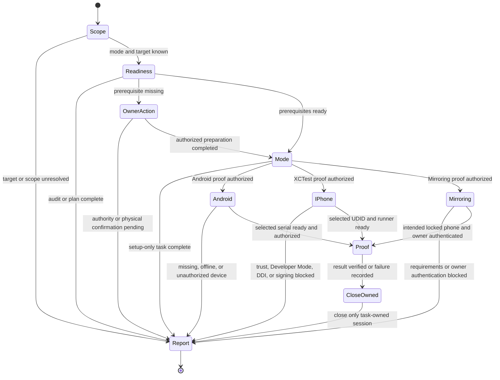

# Agent Device Lab

## Purpose

Prepare a Mac and one physical Android or iPhone for an authorized test.
This skill owns host readiness and device enrollment. Use the installed upstream
`agent-device` skill or version-matched CLI help for app-driving commands.

## When to use

- Auditing or preparing host tooling for a physical Android phone or iPhone.
- Diagnosing device trust, Developer Mode, or runner-signing blockers.
- Setting up iPhone Mirroring or proving one bounded device interaction.

For ordinary app testing on an already prepared target, use the app automation
workflow directly. Simulator setup and fleet deployment are separate tasks.

## Workflow

1. Identify the requested mode, host, physical device, app, and observable result.
   An audit or plan does not authorize installation, enrollment, settings changes,
   or app interaction. Continue within existing authorization; obtain only any
   missing authority for the specific change.
2. Inspect only the selected mode's prerequisites. Mirroring alone needs no ADB,
   XCTest runner, or agent-device installation. For agent-device, resolve the
   installed binary and version; follow its `help workflow` and current
   [installation requirements](https://oss.callstack.com/agent-device/docs/installation).
   Prefer a trusted installed or project-pinned CLI. Installing a skill does not
   install that CLI; do not silently fetch and execute a mutable `@latest` package.
3. Report missing prerequisites before changing them. Limit authorized host
   preparation to official platform tools and the selected device platform.
   Device Trust/RSA prompts, passcodes, Developer Mode confirmation, Apple Account,
   2FA, and signing-account authentication belong to the owner. Wait at that
   boundary; never collect their credentials or bypass the prompt.

### Android

Use Google's [Android SDK Platform Tools](https://developer.android.com/tools/adb).
The owner enables USB debugging and approves this host's RSA key on the phone.
`adb devices -l` must identify the intended physical serial in state `device`;
`unauthorized`, `offline`, or a missing device is a blocker. A `device` entry alone
does not prove Android has finished booting. Bind subsequent ADB commands with
`-s <serial>` and agent-device with `--platform android --serial <serial>`.

Discovery may start the local ADB server. Do not restart a shared server or reset
device authorizations as an automatic repair. Wireless pairing and helper/IME
installation require task scope beyond checking a USB connection.

### iPhone through Xcode

Use full Xcode with support for the phone's OS. Check the selected developer
directory and Xcode version before proposing a switch; license acceptance and
first-launch setup are host changes. Do not add simulator or watchOS runtimes for
a phone-only task.

The owner completes [device trust](https://support.apple.com/109054) and
[Developer Mode](https://developer.apple.com/documentation/xcode/enabling-developer-mode-on-a-device),
including its restart and confirmation. Verify the exact phone in
`xcrun devicectl list devices`; use `--platform ios --udid <udid>` for agent-device.
Keep the phone unlocked for discovery and XCTest preparation.
XCTest interaction also needs working Developer Disk Image (DDI) services and
runner signing. A paired device is insufficient proof. For a DDI failure, inspect
Developer Mode, Xcode/OS compatibility, and the exact CoreDevice diagnostic;
do not copy unverified disk images or delete shared developer state.

### iPhone Mirroring

Check Apple's current [Mirroring requirements](https://support.apple.com/120421),
including supported hardware/OS and region, the same Apple Account with 2FA,
Wi-Fi/Bluetooth, and a nearby locked iPhone. Confirm the intended phone when
several are available. Mirroring is independent of XCTest/DDI readiness.

For new setup, prefer **Ask Every Time** and decline mirrored notifications unless
requested. Preserve an existing explicit user preference. The owner completes
Mac authentication and any phone-side prompt. Do not inspect notifications or
personal content to demonstrate success. An unavailable region or unresolved
account requirement ends with a concrete blocker, not a workaround.

### Proof and closeout

When a device interaction is authorized, use a task-owned session and one named
test surface, preferably the user's test app. Select a non-personal Settings page
only if that is the agreed proof. Use `umask 077` for new agent-device state and
evidence; inspect the resolved state directory before reuse. Do not change
permissions or remove locks in another session's state.

Perform the bounded interaction, verify the expected result, and close only the
session or Mirroring window opened for this task. If setup or interaction fails,
report the failed prerequisite and the owner's next action. Keep unfinished
recovery evidence; do not turn closeout into daemon, device, or cache cleanup.
Scrub device identifiers, account names, screenshots, and logs before sharing.

### Optional upstream skill

The canonical source is [callstack/agent-device](https://github.com/callstack/agent-device).
If installing its skill is requested, the standalone installer works without a
dotskills checkout. Run from the intended project and choose the intended agent
and installation scope:

```sh
npx skills add callstack/agent-device --skill agent-device
```

This installs instructions, not the runtime. If the skill is absent, installed
CLI help remains usable. Do not run repository-wide import or sync to prepare one
device. See upstream [agent setup](https://oss.callstack.com/agent-device/docs/agent-setup).

## Inputs

- Named Mac, physical device, selected mode, and allowed host/device changes.
- Installed tool versions and relevant readiness diagnostics.
- Owner participation for trust, authentication, and signing when needed.

## Outputs

- Readiness or setup result with the exact target and verified evidence.
- Bounded interaction result, or a precise blocker and next action.
- Task-owned session closeout and any retained evidence, without private data.

## Flow


