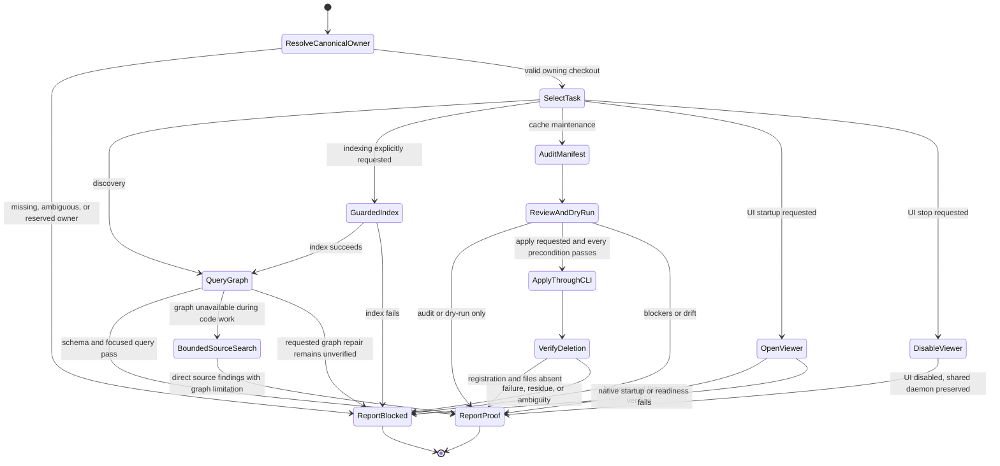

# Codebase Memory MCP

## Purpose

Bring up `codebase-memory-mcp` for the owning Git checkout and prove the graph is usable before relying on it for code discovery. Keep linked worktrees on the owner's graph instead of creating one graph per branch.

## When to use

- Initialize, re-index, refresh, or troubleshoot a repository graph.
- Use `search_graph`, `trace_path`, `get_code_snippet`, or `query_graph`.
- Verify that a repository is indexed before graph-backed exploration.
- Open the existing dependency graph in a browser when requested.
- Audit or prune duplicate linked-worktree indexes without deleting cache files directly.

## Workflow

1. Verify the repository and binary.
   - `git rev-parse --show-toplevel`
   - `git status -sb`
   - `command -v codebase-memory-mcp`
   - `codebase-memory-mcp --version`
2. Resolve the canonical owning checkout.
   - `scripts/codebase-memory-graph.sh canonical --repo "$(git rev-parse --show-toplevel)"`
   - Linked worktrees resolve through their absolute Git common directory to the one checkout that owns it.
   - Separate clones remain separate projects.
   - Independent roots under `~/.codex/worktrees`, `~/GIT/_Worktrees`, any `.worktrees` component, `/tmp`, or `/private/tmp` are never indexed. Linked worktrees under those paths may only rewrite to one existing nonreserved owner.
   - Never independently index `~/GIT/_Synthetic` or repositories marked by `.git/gwt-synthetic.json`. This indexing rule grants no cleanup authority.
   - Missing, invalid, bare, ambiguous, ownerless, reserved-owner, or NUL-containing repositories fail closed.
3. Prefer exposed MCP graph tools for discovery.
   - If the tool is absent, the service times out/closes its transport, or no usable project exists, report that surface once and continue ordinary code work with bounded `rg` and direct reads. Do not retry without changed service evidence. Graph availability is not a prerequisite for ordinary inspection or repair.
   - Installer or client configuration must separately disable the MCP `index_repository` tool because it cannot enforce the canonical indexing boundary. For Codex installs, render the private `disabled_tools` configuration accordingly.
   - When indexing is requested and the graph is missing, run `scripts/codebase-memory-graph.sh index --repo "$(git rev-parse --show-toplevel)" --mode full`. Do not start indexing or daemon repair as an incidental prerequisite to another task.
   - Use `search_graph`, `trace_path`, and `get_code_snippet` before broad text scans.
4. Use the helper for CLI indexing.
   - `scripts/codebase-memory-graph.sh init --repo "$(git rev-parse --show-toplevel)" --mode full`
   - The helper always sends the canonical owning checkout to `index_repository`.
   - Use `--mode fast` for a smoke index.
   - Installer integrations render `scripts/codebase-memory-gateway.py.tmpl` with an approved pinned backend path. Replace `@@PYTHON_PATH_SHEBANG@@` with the raw absolute interpreter path and replace `@@PYTHON_PATH_JSON@@`, `@@BACKEND_PATH_JSON@@`, and `@@RESOLVER_PATH_JSON@@` with JSON string literals containing the exact absolute interpreter, backend, and `codebase_memory_cache.py` paths. The rendered gateway has no upgrade logic and uses `execve` for pass-through.
   - The gateway guards raw CLI calls only. Zero-argument MCP stdio startup intentionally passes through to the approved backend, so the gateway is not an MCP tool-filtering proxy and does not replace the separate `disabled_tools` control.
   - The public CLI accepts a tool name and at most one JSON object. It normalizes `--json` and `--progress` before checking `index_repository`; index calls always require an explicit JSON `repo_path`. File, stdin, worker, prefixed-command, and vendor-installer forms fail closed. Default output and explicit `--json` output keep their upstream formats.
   - Installation defaults are `auto_index=false`, `auto_watch=false`, and `ui_enabled=false`. Ordinary MCP/CLI calls do not enable the viewer or reset an operator's explicit setting. Initialize the UI default with `codebase-memory-mcp config set ui_enabled false`; `ui` is not a supported backend config key.
   - Ordinary MCP clients share one session-managed daemon. Bare `daemon start` remains denied because it implicitly enables the UI. The explicit browser command `daemon start --open [--port=N]` is allowed; `daemon status` remains read-only.
5. Verify the graph.
   - `codebase-memory-mcp cli list_projects`
   - `scripts/codebase-memory-graph.sh schema --repo "$(git rev-parse --show-toplevel)"`
   - Run one focused graph query before declaring success.
6. Open the viewer only when requested.
   - `scripts/codebase-memory-graph.sh start-ui --repo "$(git rev-parse --show-toplevel)"` resolves the owner, enables the viewer, and uses native `daemon start --open`. It does not index or create tmux sessions.
   - The preference is shared and persists across daemon restarts. Ordinary loading leaves it unchanged, so another agent cannot close an explicitly opened viewer. A fresh installation starts with it off.
   - `scripts/codebase-memory-graph.sh stop-ui` restores `ui_enabled=false` without stopping the shared daemon or other sessions. Closing a browser tab alone does not disable the listener.
   - Use the guarded CLI helper for indexing; the browser's indexing endpoint does not enforce this skill's Git-owner/worktree policy. Opening an existing graph does not authorize indexing additional roots.
7. Audit cache cleanup before applying it.
   - Freeze a host-specific manifest:
     `scripts/codebase-memory-graph.sh cache-audit --manifest /secure/path/cbm-cache.json`
   - Built-in reserved roots are `~/.codex/worktrees`, `~/GIT/_Worktrees`, `/tmp`, `/private/tmp`, and any exact `.worktrees` path component. The audit records normalized lexical and resolved boundary evidence; `.worktrees` component matching is case-insensitive on Darwin.
   - Missing roots under a reserved boundary are `reserved_missing_root` candidates. Live valid graphs whose physical canonical root and Git common directory remain reserved are `reserved_live_root` candidates, including shallow, promisor, and partial clones. Dangling symlinks, bare repositories, non-Git roots, and invalid reserved mappings block as `live_root_unmapped`.
   - Other missing roots are protected unless the audit names an explicit narrow `--ephemeral-prefix`.
   - Reserved aliases or linked worktrees that resolve to a nonreserved owner retain duplicate cleanup rules. They require a mapped, registered, final-protected healthy full canonical graph; candidate graphs, reserved graphs, shallow/promisor/partial owners, missing alternate graphs, and ambiguous owners cannot preserve them.
   - When legacy home symlinks name the same physical checkout, preserve the exact canonical graph and treat only the symlink-named graph as a duplicate. Preserve a sole symlink-named graph.
   - Review the manifest, then dry-run it:
     `scripts/codebase-memory-graph.sh cache-prune --manifest /secure/path/cbm-cache.json`
   - Manifests with host blockers fail closed by default. After reviewing every relationship, explicitly add `--allow-blocked-manifest` to preflight and prune only independent candidates while preserving all protected and blocked projects.
   - To retain an exact manifest candidate at runtime, repeat `--protect-candidate NAME` on `cache-prune`. Each named candidate must still exist in the unchanged snapshot and pass its root, prefix, classification, canonical mapping, and clone-health rules. It remains in the expected snapshot but is excluded from cache inventory, holder sweeps, DB integrity preflight, final holder probes, and deletion.
   - Runtime candidate protection does not bypass host blockers; add `--allow-blocked-manifest` independently when blockers were reviewed. Unknown, duplicate, or non-candidate names fail before preflight.
   - Apply only the unchanged manifest:
     `scripts/codebase-memory-graph.sh cache-prune --manifest /secure/path/cbm-cache.json --apply`
   - Dry-run and apply freeze regular DB/WAL/SHM fingerprints for every eligible candidate in manifest order, rejecting a missing or size-mismatched DB, nonregular files, and nonzero WAL. Existing absolute paths are swept with `/usr/sbin/lsof -nP -F0pfn -f --` in deterministic, NUL-parsed batches before any SQLite open and again after every exact `mode=ro&immutable=1` `quick_check`; global fingerprint equality is required between phases. An absent or zero-byte WAL and a stable regular SHM are allowed. Use prune-only `--lsof-timeout-seconds SECONDS` to override the 300-second holder timeout within the guarded 30-900 range.
   - Batch holder sweeps are point-in-time checks: they do not prevent a legacy index or server surface from reopening a graph after the check. Unprivileged `lsof` may not see root-owned or other-user holders, so pruning trusts the point-in-time visibility available to the cache owner; running as root provides stronger holder visibility. Apply processes eligible candidates in manifest order, at most eight per deletion batch and within the same 128 KiB path budget. Each batch revalidates the snapshot and live fingerprints, performs one holder sweep, proves post-sweep fingerprint equality, then revalidates every remaining candidate relationship immediately before the first delete child. The batch launches only `codebase-memory-mcp cli delete_project` children and verifies registrations plus DB/WAL/SHM absence before continuing; spawn errors, timeouts, nonzero exits, retained registrations, residue, drift, or ambiguous state stop future batches and report launched, verified-deleted, failed, and ambiguous names and bytes.
   - Before applying any manifest containing `reserved_live_root`, deploy the reserved-root indexing prevention and quiesce every legacy index/server surface outside this helper. The helper reports this operational precondition but does not probe or kill processes.
   - Deletion uses `codebase-memory-mcp cli delete_project` only. Never remove project databases directly.
8. Report exact proof.
   - Indexed project name.
   - Node and edge counts when available.
   - Browser URL and verified listener state when the viewer was requested.
   - For cleanup: manifest path and digest, manifest/eligible/preflighted candidate totals, runtime protected names/reasons/bytes, required operational preconditions, before/after project and byte totals, deleted project names, and any stop condition.
   - Missing binaries, unavailable MCP tools, or incomplete proof.

## Inputs

- Repository path.
- Index mode: `fast`, `moderate`, `full`, or `cross-repo-intelligence`.
- Optional browser/status listener port; default `9749`.
- For cache maintenance: a host-local manifest path, optional explicit ephemeral prefixes, and optional exact runtime protected candidate names.

## Outputs

- Indexed and queryable repository graph.
- Explicitly opened browser viewer, or disabled viewer with agent sessions preserved.
- A dry-run cache manifest or guarded CLI-only deletion report.
- Exact status, schema, and proof summary.

## Flow

