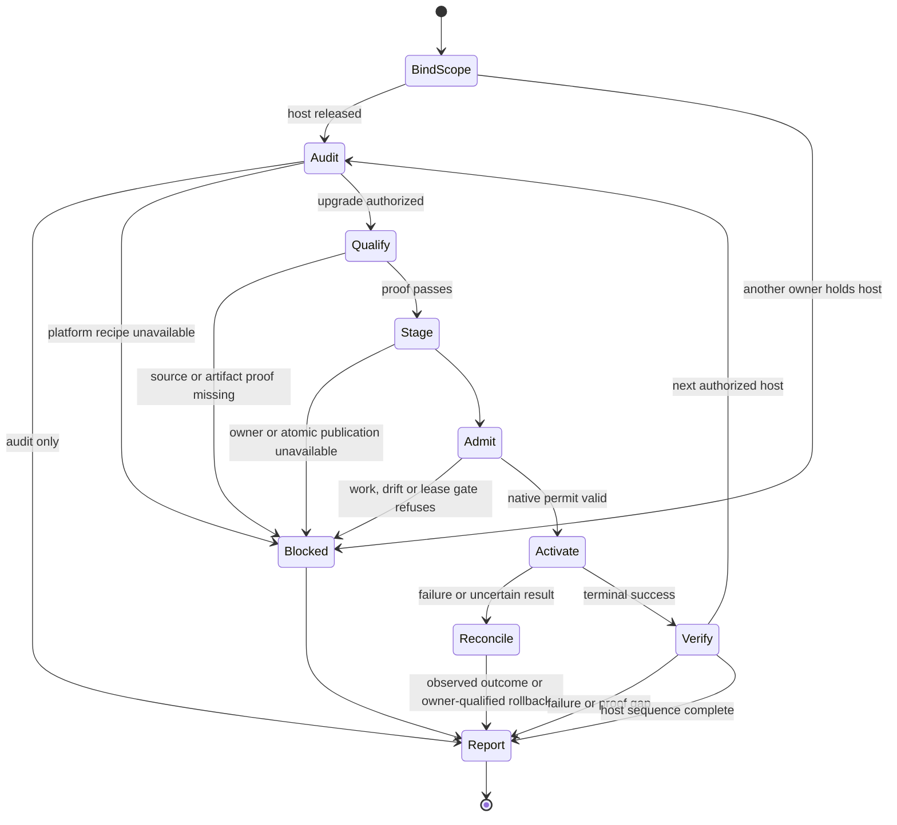

# OpenClaw Bun Upgrade

## Purpose

Move an authorized Linux OpenClaw service to one verified Bun artifact while preserving
its deployment owner, application source, state and active work. Keep source
synchronization, build publication and runtime promotion as separate outcomes.

## When to use

- Updating an OpenClaw Bun fork or selecting a daily build for a service.
- Building and qualifying a pinned Bun artifact for staged host promotion.
- Auditing how a service selects Bun, or preparing its runtime rollback.

The build and service recipes below cover Linux ELF and systemd deployments.
For macOS or Windows, report the missing platform-specific qualification and
service-owner route; do not apply Linux commands to those hosts. Source ancestry
and immutable artifact selection principles still apply.

An audit does not authorize deployment. A runtime upgrade does not authorize an
OpenClaw update, state migration, service-owner migration or automatic scheduler.

## Workflow

1. **Bind scope and coordination.** Name the hosts, deployment order, exact source,
   requested actions and completion conditions. Read each host's current owner
   instructions. If another recovery thread owns the host, exchange active
   command, lease and reservation status; wait for its explicit release before
   host commands or relay use. A release resolves coordination, not admission.
2. **Audit actual selection.** Resolve service UID/GID and NSS home, native versus
   external owner, unit plus drop-ins, effective executable and live PID/start
   identity, application source/build, config revision and schema. Inspect native
   runtime pins, update runs and rollback custody. Shell `bun --version`, PATH,
   an old `current` link or a campaign label is not running-service proof.
3. **Freeze source and artifact.** Read [Build qualification](references/build-qualification.md).
   Reuse qualified objects and one artifact. Preserve upstream ancestry with a
   normal merge when requested; verify reachability rather than judging the PR's
   displayed diff. Freeze the full commit/tree before building. A newer daily
   candidate does not invalidate work on an already selected commit.
4. **Qualify the candidate.** Match CPU baseline and ELF requirements to every
   target. Test the changed Bun bug class and actual OpenClaw consumers, with
   candidate identity inside workers. Scope carried proof to unchanged inputs.
   A successful build or generic smoke test alone is insufficient.
5. **Prepare promotion.** Read [Native promotion](references/native-promotion.md).
   Stage a versioned artifact, verify hash/ownership as the service account and
   establish rollback through the same deployment owner. Check the directory
   that must permit atomic replacement, not only the selected file. Do all
   expensive build and preflight work before acquiring a short maintenance lease.
6. **Admit and activate once.** Use the deployed owner's native preserving
   admission, operation lock and service lifecycle. Live work blocks promotion
   unless that owner's exact durable continuation contract proves otherwise.
   Do not generalize a previously safe paused task or reuse another host's waiver.
   Lease, process or configuration drift stops activation. Uncertain mutation
   means reconcile the existing attempt; do not replay it.
7. **Verify the successor.** Prove its actual executable hash, UID/cgroup and new
   process identity; unchanged application/config/schema when only Bun changed;
   restored admission; preserved task generations, payloads and bindings; health
   and an affected real consumer. Inspect relevant new-process errors. Report
   synthetic proof separately from live delivery or a naturally observed GC cycle.
8. **Promote the next host only after the first passes.** Each host gets fresh
   ownership and admission proof; artifact compatibility may be reused. If blocked,
   report the precise failed gate and release command/lease/reservation custody.
   Preserve another owner's recovery material. Do not keep polling after a bounded
   check or retry an unchanged failure.
9. **Close out.** Report source sync, artifact qualification, per-host deployed
   identity, remaining blockers and checkout disposition separately. Release the
   task's builder and child processes. Keep the previous runtime while rollback
   needs it, and the candidate while another authorized rollout remains unfinished.
   Dispose of task scratch through its owner when no unfinished work needs it.

## Inputs

- Authorized repository, full Bun commit and requested host order.
- Current service owner and deployment controls, source/build/config identity.
- Candidate provenance, compatibility and test results; rollback predecessor.
- Recovery coordination status and the native admission contract at that revision.

## Outputs

- Exact source/tree, artifact SHA-256, revision, build inputs and proof limits.
- Per-host `verified`, `blocked`, `failed` or `not attempted` result, with the
  actual observed runtime and application identity and observation time.
- Explicit command/lease/reservation release status and retained recovery custody.
- Named follow-ups for unrelated failures; no implied auto-update enablement.

## Flow

