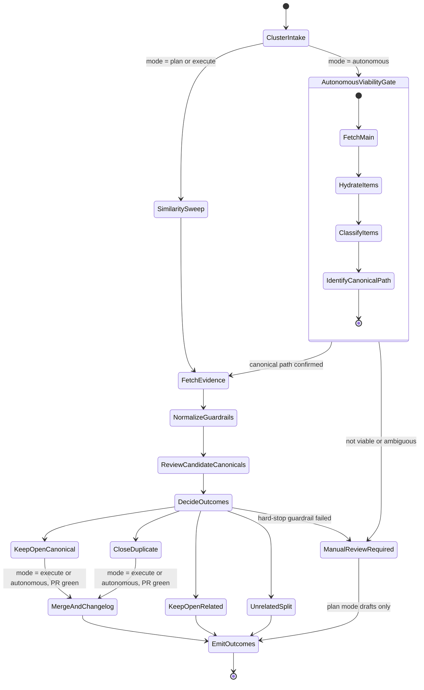

# Flow

State chart for the cluster dedupe/closeout workflow described in `SKILL.md`. Covers mode
selection, the autonomous-mode viability gate, the shared evidence/decision pipeline, and
the outcome states.

