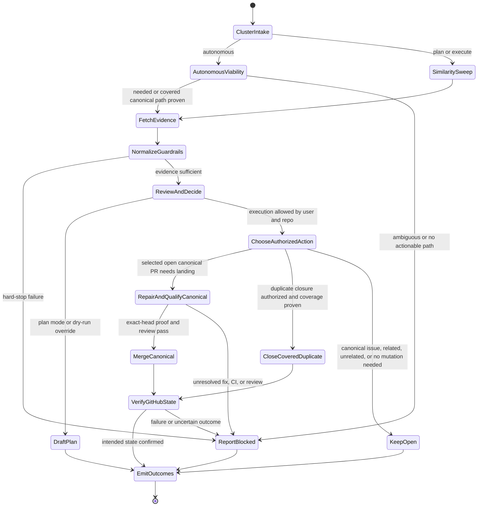

# Flow

The prose workflow owns the guards. Apply this per item; merging the canonical
PR and closing a covered duplicate are distinct actions. Plan mode and
`dry_run=1` never enter the mutation paths.

```mermaid
stateDiagram-v2
    [*] --> ClusterIntake
    ClusterIntake --> AutonomousViability: autonomous
    ClusterIntake --> SimilaritySweep: plan or execute
    AutonomousViability --> FetchEvidence: needed or covered canonical path proven
    AutonomousViability --> ReportBlocked: ambiguous or no actionable path
    SimilaritySweep --> FetchEvidence
    FetchEvidence --> NormalizeGuardrails
    NormalizeGuardrails --> ReportBlocked: hard-stop failure
    NormalizeGuardrails --> ReviewAndDecide: evidence sufficient
    ReviewAndDecide --> DraftPlan: plan mode or dry-run override
    ReviewAndDecide --> ChooseAuthorizedAction: execution allowed by user and repo
    state ChooseAuthorizedAction <<choice>>
    ChooseAuthorizedAction --> RepairAndQualifyCanonical: selected open canonical PR needs landing
    ChooseAuthorizedAction --> CloseCoveredDuplicate: duplicate closure authorized and coverage proven
    ChooseAuthorizedAction --> KeepOpen: canonical issue, related, unrelated, or no mutation needed
    RepairAndQualifyCanonical --> MergeCanonical: exact-head proof and review pass
    RepairAndQualifyCanonical --> ReportBlocked: unresolved fix, CI, or review
    MergeCanonical --> VerifyGitHubState
    CloseCoveredDuplicate --> VerifyGitHubState
    VerifyGitHubState --> EmitOutcomes: intended state confirmed
    VerifyGitHubState --> ReportBlocked: failure or uncertain outcome
    KeepOpen --> EmitOutcomes
    DraftPlan --> EmitOutcomes
    ReportBlocked --> EmitOutcomes
    EmitOutcomes --> [*]
```

After a canonical merge is confirmed, re-evaluate covered items through the
same decision path. An already-merged canonical commit needs no second merge;
covered issues can close without inventing an open green PR prerequisite.
