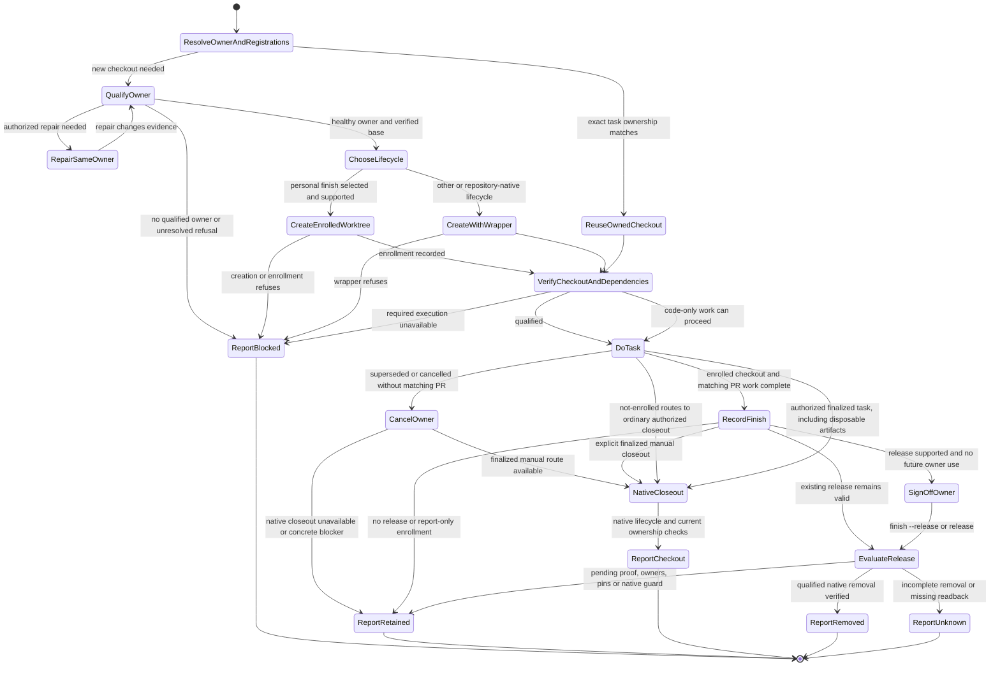

# Operations Worktree

## Purpose
Create and manage worktrees safely and consistently across projects while avoiding stale branch bases.

## When to use
- You need a new task branch in a new worktree.
- You are juggling many concurrent worktrees.
- You need to avoid branching from stale local `main` or local `HEAD`.

## Workflow
1. Identify the producer: shell GWT, a repository-native wrapper, or an application
   that owns sessions or sandbox projections. Resolve the repository identity,
   canonical owning checkout, Git common directory, and existing worktree registrations.
   A `.git` entry does not make an application-owned workspace a personal GWT task;
   preserve its native allocation, relocation and retention lifecycle.
   Preserve dirty owner state.
   Read the repository's worktree and dependency rules.
2. Inspect existing worktrees before creating another checkout.
   Reuse an existing task-owned worktree only when its identity, branch, and ownership match.
   Do not adopt another session's checkout.
3. Use a healthy owning checkout accepted by the installed wrapper.
   An unsafe, shallow, or promisor source is not permission to create an ad hoc clone.
   Do not bypass worktree creation with raw Git, copied repositories, or temporary clones.
   A refusal stops creation, not diagnosis. Repair that same verified owner within existing task authorization, then let the wrapper recheck it.
   Report the concrete blocker if no qualified owner is available.
4. Use `gwt help` for discovery and `gwt root` to resolve the configured managed root.
   Keep new worktrees under that root or a repository-native managed root.
   Do not place new checkouts in arbitrary sibling or temporary directories.
   For server placement policy, use the existing account-specific
   `DOTFILES_WORKTREES_ROOT` setting; preserve unrelated workstation defaults.
   Check the host policy, actual account homes, physical path, mount and permissions
   separately: `gwt root` reports a value, not an access boundary.
   Changing this setting neither relocates existing work nor controls application
   allocators. Use the native owner to update registrations and persisted references;
   do not substitute shell GWT for an application's workspace lifecycle.
5. Verify the download policy before any fetch.
   Task-required additive fetch or unshallow is not GC, repacking, pruning, or owner consolidation.
   Recheck current state; do not repeat completed repair or ask again for an already authorized step.
   Respect contention, suppress automatic maintenance/pruning, and preserve local branches, HEAD/index, patches, and registrations.
   Distinguish a verified current remote base from a cached local ref.
   Cached refs do not prove the latest head.
   When freshness cannot be verified, report that gap rather than silently substituting a stale base.
6. Choose the creation command for the intended completion lifecycle:
   - When selecting finish tracking for a new personal GWT task, and `gwt help`
     advertises `--finish-managed`: `gwt new <branch> <start-point> --finish-managed`.
     The start-point is optional. Keep the runtime `CODEX_THREAD_ID`; outside Codex,
     set a stable task-specific `GWT_OWNER_ID` before creation.
   - Other or repository-native wrappers use their documented creation and closeout commands.
   Finish enrollment is optional and creation-only. It records ownership and does
   not authorize removal. It is not a prerequisite for development, maintainer work,
   or ordinary authorized cleanup; keep repository-native lifecycles independent.
   Stop creation if the wrapper is unavailable or still refuses the repaired owner.
   Do not substitute an unrestricted raw-Git creation route.
7. Verify the returned path, managed root, registration, owner, branch, and HEAD.
   For personal finish, confirm enrollment with `gwt finish-status` before starting work.
8. Verify dependency reuse under [Dependency Ownership](#dependency-ownership).
9. Read `references/task-artifacts.md` before work that retains evidence,
   publishes expensive artifacts, or needs a resumable phase/blocker receipt.
10. For OpenClaw, use its current `AGENTS.md` and native review/release lifecycle
    helpers. Do not override their exact-head or evidence rules here.
11. Finish with the explicit [Closeout](#closeout) result.

## Dependency Ownership

Inspect the source pin and actual installed package-manager metadata separately.
Verify lockfile compatibility, workspace dependency graph, patches, platform, linker layout, and resolved dependency paths before reuse.
A matching store path or package-manager major version does not prove compatibility.
Do not assume a root dependency symlink supplies every workspace package.

APFS copy-on-write package imports can share storage without sharing a Git checkout.
They are not Git snapshots, worktree creation, or cleanup.
Do not infer physical reclaim from logical dependency sizes.
Inspect the installed package manager's contract before applying an APFS optimization.

Follow the repository and user dependency rules, existing authorization, and shared-symlink guards.
If the install is incompatible or missing, use the repository's approved proof route.
Do not add a new approval requirement for dependency work already authorized by that route.

## Closeout

Report the exact task-owned path, branch, HEAD, owner, and remaining work.
Give each task checkout an explicit outcome:

- `retained`: keep the checkout, with its reason and next owner or action.
- `blocked`: name the missing proof or permission and the exact unblock action.
- `removed`: report only after authorized removal verifies path and registration absence.
- `unknown`: preserve an incomplete removal result; reconcile its exact intent read-only before recovery.

Normal owner finalization includes disposing of routine task output and closing
its exclusive checkout when no unfinished work or shared consumer needs it,
unless the user asked to keep it. Do not request a new cleanup approval for
that closeout. Use the native owner release/removal route; task completion
does not permit bypassing its guards or touching another owner's workspace.
Checkout retention does not keep a completed task active. Record the retained
path and its concrete remaining condition once, then finish the requested work.
Optional proof or profiling must not become a new closeout requirement.
After required validation and delivery, or explicit cancellation/supersession,
routine task logs, receipts, test captures, proof archives, build output, and
checkpoints are disposable by default. Include them in authorized task cleanup;
do not require an archive, external publication, retained copy, or another
discard approval. Explicit user discard overrides earlier task-local retention.
Required validation before finalization remains unchanged.

For a known finite task, one execution owner checks current path/registration,
Git state, owners/holders/locks, and shared dependencies, uses the installed
native closeout route, then verifies the outcome. Use chat for the result;
do not impose fleet delegation, a typed host audit, or a new cleanup manifest.
Keep unfinished or unknown source, live owners, credentials, other-owner data,
shared dependencies, and actual release/customer deliverables protected. Known
obsolete amend/rebase/reflog versions of finalized work need no archival refs;
this does not authorize shared-store expiry or pruning.

For superseded, cancelled or already-applied work without a matching PR, use
`gwt cancel --reason <text>` only when the installed helper advertises it.
Cancellation records the disposition; it need not invent PR proof. Continue
through the installed finalized-task closeout route when available. If that
route is unavailable, report the concrete native limitation once rather than
repeating finish or creating another recovery archive.
Ordinary and repository-native checkouts keep their existing authorized lifecycle:
removal requires current ownership and live-use checks, protection of unfinished
work, and the repository's approved non-force procedure.

For a finalized checkout with no remaining use, prefer the advertised manual
finalized closeout below. Finish/release remains useful for retained or queued
work; it is not an extra gate before manual finalized closeout.

Personal GWT completion applies only to explicitly enrolled `--finish-managed`
worktrees. Record the current owner's completed work promptly with
`gwt finish --pr <full URL>`, even if the PR has not merged.
Plain finish grants no new release and does not cancel an earlier sign-off.
Treat generic Codex Stop as turn-scoped attention only, never completion or release.

When the installed wrapper advertises `finish --release` and this new enrollment
supports release, use `gwt finish --pr <full URL> --release` once this owner's
job is complete and it relinquishes future checkout use. Use `gwt release`
for an already completed owner. This is explicit local job sign-off.
Every enrolled owner, including the creator, must complete and release against
the same proof. A finished fix or feature can be removed as soon as its exact
PR head has merged into the final target and native admission passes; age adds no delay.

For stacks, first record an owner-scoped `gwt finish-pin --reason <reason>`
while upper work or recovery still needs the checkout. Then record completion
with `--target <final branch>` when needed and repeat `--wait-for <full PR URL>`
for every dependent PR. Each declared PR must target that same final branch;
they need not be merged to record completion. Only the pin's owner clears it
with `gwt finish-unpin --reason <reason>` once resolved; owners must release
afresh afterwards. All declared PRs must merge at their recorded heads before
removal; open or closed-unmerged PRs retain the checkout.

If an upper PR targets another stack branch, keep its dependency and pin,
and report the checkout retained until the stack is retargeted or restacked
to the actual final branch. Do not fake `--target` or omit `--wait-for` to pass finish.

Resume before further use. `gwt resume`, `gwt cd`, reuse through `gwt new`,
and sparse-profile changes invalidate prior completion and releases.
Head, target or dependency changes require fresh completion and release;
adding a pin reactivates ownership and any pin change invalidates releases.
Never sign off for another owner.

`gwt finish-status` reads recorded state; `gwt finish-check` refreshes proof
without removal. On an explicitly activated, natively qualified host, the same
`gwt finish-check --all --apply --policy <absolute path>` consumer can revisit
pending merges and departure. Installing source or reporting release capability
does not activate deletion or prove removal readiness.
The wrapper parks only its own shell; checkout/admin CWD, FD or mapped holders
still block removal. Preserve native guard failures and their exact reasons.

If finish reports `not-enrolled`, it has no finish enrollment to manage; this is
not a retention requirement or a failed cleanup safety check. Stop using finish
for that checkout and continue through its ordinary authorized closeout route.
Verify the exact path and registration, task ownership, clean Git state, no live
users or locks, and that source and required recovery content remain available
before native non-force removal. Retain only for a concrete unresolved condition,
not missing enrollment alone; existing cleanup authorization still applies.
Do not retrofit enrollment or recreate a checkout for release capability.
Existing report-only enrollments remain report-only. Respect the installed
native manual closeout contract without bypassing a refusal.
When `gwt help` advertises finalized manual removal, use
`gwt rm <literal-path> --finalized` for an explicitly finalized enrolled task.
Unenrolled tasks use ordinary `gwt rm`. Name only
known disposable ignored roots with repeated `--discard-ignored <relative-root>`
when needed. This owner-managed route is separate from automatic host
qualification; never manually unlock or edit its lifecycle state.

Unfinished or unknown source, active owners, unknown commits, locks, active
recovery pins, or unresolved ownership require retention. Routine finalized
task artifacts do not, even when ignored or untracked. Native non-force removal
preserves branches unless its explicitly authorized contract says otherwise.
Do not start broad maintenance, clear locks, or remove other sessions' checkouts.
Never retry an uncertain removal automatically or label an unknown result retained.

## Inputs
- Branch name (required)
- Optional start-point (branch/tag/commit)
- Canonical owner and configured managed root

## Outputs
- New linked worktree on the target branch.
- Verified owner, managed path, registration, branch, and exact base.
- Remote freshness status and dependency compatibility evidence.
- Explicit `retained`, `blocked`, verified `removed`, or unresolved `unknown` outcome.

## Flow

