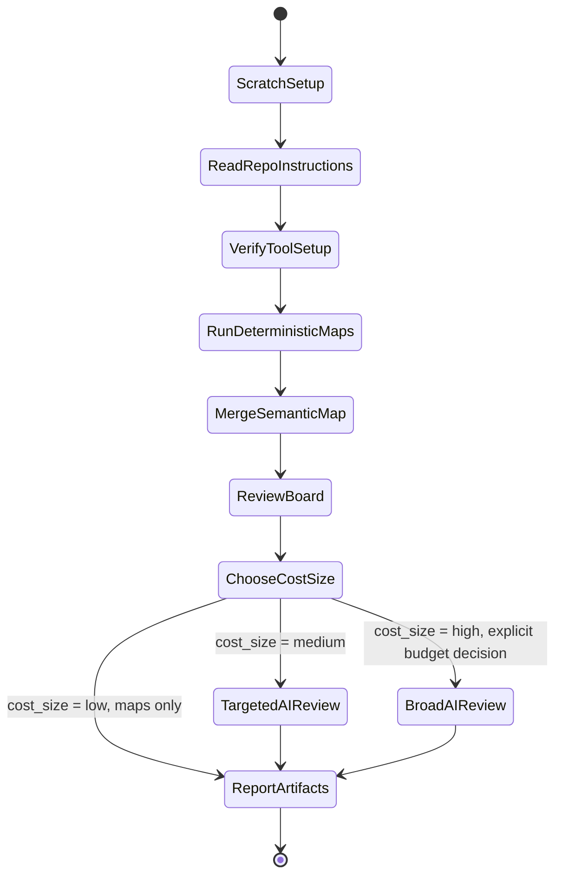

# Semantic Slicing

## Purpose

Turn a large repo into reviewable semantic slices with evidence. Use code shape, threat candidates, issue clusters, and support chatter together so review budget lands on the right parts of the system.

Default stance: map locally first, rank second, spend agent/security-review budget last.

## When to use

- Setting up or running `openclaw/clawpatch` against a target repo.
- Setting up or running `vercel-labs/deepsec` against a target repo.
- Producing a local visual map of feature slices, risky files, ownership clusters, or review targets.
- Cross-checking code slices against `gitcrawl` issue/PR data or `discrawl` Discord/support data.
- Planning a focused security, regression, architecture, or maintainer-review pass for a large repo.

## Workflow

1. Create a scratch run directory outside the target checkout, usually `~/.semantic-slicing/<repo>/<timestamp>`.
2. Read target repo instructions before scanning. For OpenClaw, read root `AGENTS.md`; subtree guides matter when reviewing a slice.
3. Verify tool setup:
   - `clawpatch`: clone/build `openclaw/clawpatch`, then run `clawpatch init`, `clawpatch map`, `clawpatch status`.
   - `deepsec`: clone/build `vercel-labs/deepsec`, scaffold a scratch workspace, then run `deepsec scan`.
   - `gitcrawl`: run `gitcrawl doctor --json`, then pull clusters/threads for related issue evidence.
   - `discrawl`: run `discrawl doctor --json` and `discrawl status --json`; use search/digest only when support chatter is relevant.
4. Run deterministic maps before AI review:
   - Clawpatch feature map for entrypoints/packages/config/test slices.
   - Deepsec regex scan for candidate threat surfaces.
   - Optional repo git overlay for CODEOWNERS routing, tracked files, code/test/doc shape, and recent churn.
   - Optional gitcrawl/discrawl lookups for historical pain around the same files, components, or symptoms.
5. Run `scripts/semantic-map.mjs` to merge the local artifacts into `semantic-map.html` and `semantic-map.json`.
   - Sparse mode is on by default and omits dotfile/config trees, docs, changelog files, and mobile app trees so core review stays focused.
   - Use `--no-sparse` or `--sparse false` for the full repo; use `--sparse-exclude <csv>` and `--sparse-include <csv>` to tune the filter.
6. Review the board in product order:
   - review lanes first: semantic shape, ownership routing, development pressure, security pressure, issue pressure, support pressure,
   - focus controls second: lens and system filters that narrow the matrix without duplicating rows,
   - overall lens matrix third: the single slice-row table with comparable bars for semantic, ownership, development, security, issue, and support lenses,
   - agent handoff packet fourth: compact JSON for follow-up agents,
   - evidence tables last: raw-ish overlays for audit, not the primary reading path.
7. Choose a cost size before running AI stages:
   - `low`: deterministic maps only; no `deepsec process` or real `clawpatch review`.
   - `medium`: one to three explicit files/features with high-risk slugs, batch size 1, concurrency 1, and a turn cap.
   - `high`: broader AI processing or multiple feature reviews; requires an explicit budget/time decision.
8. Run AI only at the chosen size:
   - `clawpatch review --feature <id>` or a small `--limit`.
   - `deepsec process --files <csv>` or tightly scoped `--filter` plus `--only-slugs`.
9. Report exact artifact paths, run IDs, counts, cost size, exclusions, and skipped expensive stages.

## Flow

## Inputs

- `target_repo`: local checkout path and/or GitHub `owner/repo`.
- `scratch_root`: local artifact directory, default `~/.semantic-slicing/<repo>/<timestamp>`.
- `clawpatch_repo`: local clone of `openclaw/clawpatch`, optional if `clawpatch` is already on PATH.
- `deepsec_repo`: local clone of `vercel-labs/deepsec`, optional if `deepsec` is already on PATH.
- `focus`: optional path prefixes, issue numbers, slugs, components, or channels to prioritize.
- `sparse`: optional map filter, default `true`; excludes dotfile/config, docs/changelog, and mobile app paths unless configured.
- `cost_size`: `low`, `medium`, or `high`; default `low`.
- `budget_mode`: `map-only`, `targeted-ai`, or `full-ai`; default follows `cost_size`.

## Outputs

- Tool setup status and blocker list.
- Clawpatch feature counts and contamination checks.
- Deepsec scan run ID, candidate counts, top slugs, and top files.
- Optional repo overlays from `--repo`: CODEOWNERS routing, tracked files, code/test/doc shape, 90-day churn, and test-gap pressure.
- Optional gitcrawl cluster/thread evidence and discrawl support evidence.
- Local semantic review board: `semantic-map.html` plus machine-readable `semantic-map.json`.
- Clean semantic buckets, ownership overlay, development overlay, security overlay, issue overlay, support overlay, and normalized queues.
- Human review lanes, focus controls, agent handoff packet, and ranked next commands per lens with cost-size rationale.

## Guardrails

- Keep generated artifacts out of the target repo unless the user explicitly wants checked-in config.
- Do not run full `deepsec process` or broad `clawpatch review` without an explicit high-cost decision; these can be expensive and noisy.
- Treat local nested worktrees and dot-agent folders as contamination unless intentionally in scope: `.claude/`, `.codex/`, `.agents/`, `.deepsec/`, `.semantic-slicing/`.
- If a tool maps contaminated paths, post-filter before ranking and call out the upstream limitation.
- Never paste secrets from scan outputs. Scrub absolute personal paths before external PRs/comments.
- For OpenClaw, use Testbox/Crabbox only when the task moves from mapping into validation.

## References

- Read `references/workflow.md` for concrete local setup and run commands.
- Read `references/slicing-taxonomy.md` when choosing slice types or map layers.
- Read `references/openclaw-profile.md` when the target is `openclaw/openclaw`.
