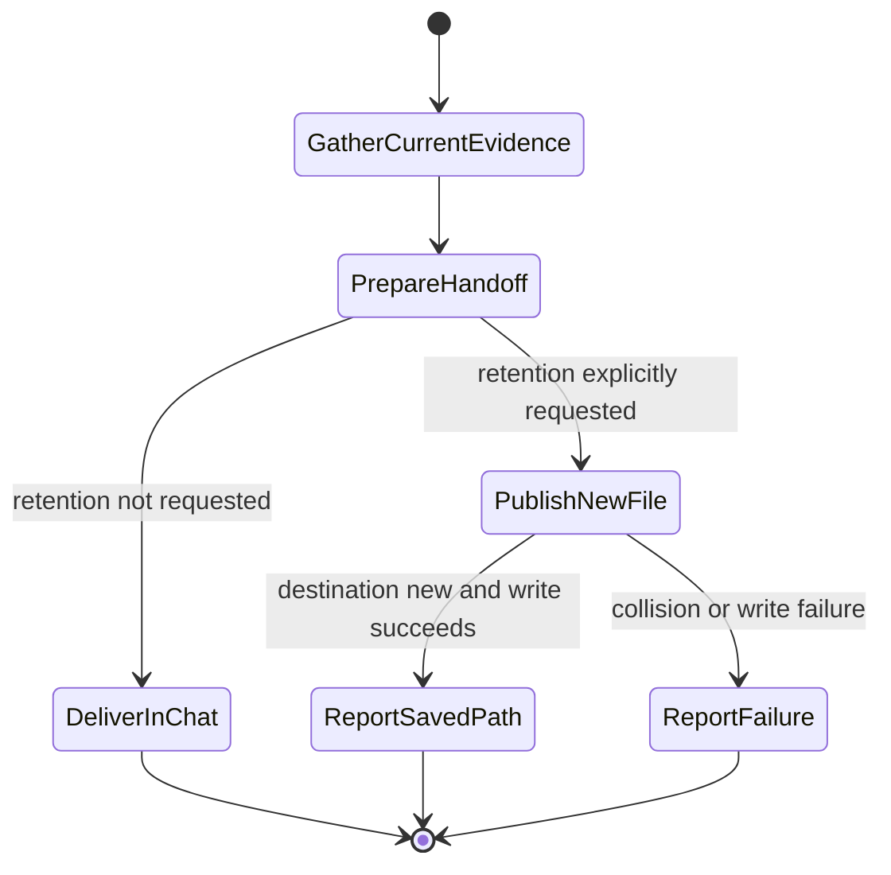

# Session Done

## Purpose

Capture the outcome, evidence, unresolved work, and next action without making session completion a cleanup or memory-write command.

## When to use

- The user asks for a session handoff, continuation summary, or `/done`.
- The user requests a durable Markdown handoff, including a note in a PKM/Obsidian folder.

## Workflow

1. Use the current task's evidence. Record completed work, validation and its limits, blockers, and the next owner/action. Do not scan unrelated sessions or copy credentials, private logs, or raw transcripts.
2. Include known session, branch, commit/PR, and retained-checkout identities when relevant. Mark unknown facts as unknown. Completion does not terminate sessions, remove worktrees, release owners, or rerun cleanup.
3. Return the handoff in chat by default. For deterministic Markdown, run `python3 scripts/session-done --summary "..." --state "..." --follow-ups "..."`; it writes only stdout.
4. If the user explicitly requested retention, use one named destination with `--output <new-path>`. The parent must already exist; existing files and symlinks are refused. A PKM/Obsidian folder can be that destination, without a second copy or sync service.
5. Report the created path or exact failure. A failed write is not saved evidence. Preserve existing notes and recovery material; do not retry under new filenames automatically.
6. Update memory only when the user directly requests it, through the environment's existing memory workflow. This writer never appends to shared memory or edits agent-managed memory files. Report that separate action's outcome.

## Inputs

- At least one content flag: `--summary`, `--decisions`, `--questions`, `--follow-ups`, `--state`, `--reflection`, or `--flashcards`.
- Optional `--session-id` and `--branch`: verified values; both default to `unknown`.
- Optional `--output`: the explicitly requested new Markdown file. No environment variable enables retention, copying, or memory writes.

## Outputs

- Structured Markdown on stdout by default, containing only supplied sections plus metadata.
- With `--output`, one UTF-8 file published from complete staged bytes without overwriting another note; success is reported on stderr. Temporary staging is confined to the destination directory and removed when the command exits normally or handles a write failure.
- Atomic publication applies to that one file, not a multi-file transaction or power-loss durability guarantee. An interrupted process can leave its staging file; preserve unknown files instead of sweeping the directory.

## Flow

